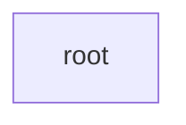

# /kaggle-start — stage 0, bootstrap + understand + toolkit

You are at the very front of the pipeline (see CLAUDE.md "Canonical run order").
Gates you own: **understand** and **toolkit**. Both are human gates unless
`config.md` says `full_auto`. Do the work, then render the cards and wait.

## 0 · derive the slug

The arg is a URL or a bare slug. Strip it to the slug:

```bash
ARG="$1"
SLUG=$(printf '%s' "$ARG" | sed -E 's#https?://[^/]*kaggle.com/(c/|competitions/)?##; s#/.*##' | tr -d ' ')
COMP="comps/$SLUG"; echo "slug=$SLUG"
```

If `$SLUG` is empty or still contains a scheme, ask the human for the plain slug
and stop.

**Resume check.** If `$COMP/progress.md` already exists, this comp was started
before — read it, resume at the first unticked stage (and if experiments exist,
read `graph.md` for the node map; a `running` node resumes from its `stage`
field). Do NOT re-scaffold. Only continue below if it is absent.

## 1 · scaffold comps/<slug>/

Dates come from the shell, never memory:

```bash
TODAY=$(date -u +%F)              # 2025-01-31
NOW=$(date -u +%Y-%m-%dT%H:%MZ)   # 2025-01-31T09:12Z
mkdir -p "$COMP/data" "$COMP/champion"
```

Create these files. Touch the empty append-only logs first:

```bash
: > "$COMP/journal.md"; : > "$COMP/submissions.md"
```

`graph.md` — THE MAP, scaffolded as an empty graph (a header line, a Mermaid block
with just the `root`, and an empty `## nodes` table; downstream stages add nodes):

````markdown
# <slug> — experiments
metric: <m> (<dir>) · champion: none · updated <TODAY>



## nodes
| node | what it is | cv | lb | status | detail |
|------|------------|----|----|--------|--------|
````

Use `<m>`/`<dir>` from `spec.md` once written (leave as placeholders if scaffolding
before spec; the next stage to add a node fills them in).

`config.md` — autonomy dial defaults to interactive:

```markdown
# config — <slug>
autonomy: interactive
# interactive | auto_except_submit | full_auto  (flip by voice; see CLAUDE.md)
```

`progress.md` — the macro resume file. The header line is derived from `date -u`
(regenerate it on every read; deadline filled from spec.md once written):

```markdown
# progress — <slug>
today (UTC): <TODAY>   submissions: 0/<limit, tbd from spec> (resets 00:00 UTC)   deadline: <tbd from spec>

## one-time setup (human)
- [ ] KAGGLE_USERNAME + KAGGLE_KEY in env        → kaggle_io ensure_auth passes
- [ ] competition rules accepted in browser      → download returns 200
- [ ] account phone-verified (GPU/internet)      → only if kernels needed
- [ ] data downloaded + unzipped                 → comps/<slug>/data/
- [ ] spec.md written                            → comps/<slug>/spec.md

## stages
- [ ] understand   (card approved)
- [ ] toolkit      (card approved)
- [ ] eda          → /kaggle-eda
- [ ] validate     → /kaggle-validate
- [ ] baseline     → /kaggle-baseline
- [ ] experiment   → /kaggle-experiment
```

Append the first journal line (timestamped, one line per event); leave
`submissions.md` empty and `graph.md` at its empty-map scaffold (downstream stages
add nodes):

```bash
printf '%s  bootstrap comps/%s  (autonomy=interactive)\n' "$NOW" "$SLUG" >> "$COMP/journal.md"
```

## 2 · surface the one-time human provisioning, then maybe STOP

Three things are **non-automatable** and must be done by the human once (CLAUDE.md
"Kaggle integration"). Check auth and probe the download; if it fails, map the
error and STOP — do not retry around a 403.

```bash
[ -n "$KAGGLE_USERNAME" ] && [ -n "$KAGGLE_KEY" ] && echo "auth env: present" || echo "auth env: MISSING"
```

If auth env is missing, tell the human verbatim:

> Before I can pull data I need a Kaggle API token. Go to kaggle.com → your
> profile → Settings → API → "Create New Token" (downloads `kaggle.json`), then
> set in this shell: `export KAGGLE_USERNAME=...  KAGGLE_KEY=...`. Also (one time
> per comp): **accept the competition rules** on the comp page, and
> **phone-verify** your account if you'll use GPU/internet kernels. Tell me when
> done and I'll retry.

Then **stop and wait**. Do not proceed without auth.

## 3 · download data + sample_submission (kaggle-io)

Pull everything for the comp (the wrapper unzips automatically):

```bash
uv run tools/kaggle_io.py download "$SLUG" --dest "$COMP/data"
RC=$?
```

If `RC != 0`, classify the failure and act — never silently retry a 403:

```bash
# capture the stderr line you saw, e.g. "403 Forbidden"
uv run tools/kaggle_io.py classify-error --text "<paste the error line>"
```

- `rules_not_accepted` (this is what **403** maps to — the #1 misdiagnosis is
  reading it as bad creds): tell the human to **accept the rules in the browser**
  (and phone-verify), then **STOP**. Do not loop.
- `auth`: re-surface the env-token instructions from step 2 and STOP.
- `not_found`: the slug is wrong — confirm it with the human and STOP.
- `rate_limited`: the wrapper already backed off; if it still failed, wait and
  retry once.

On success, list what landed and locate the sample submission:

```bash
ls -R "$COMP/data" | head -50
SAMPLE=$(ls "$COMP"/data/{sample_submission*,*sample*sub*,SampleSubmission*} 2>/dev/null | head -1)
echo "sample_submission: ${SAMPLE:-NOT FOUND}"
```

If there is no sample_submission (common in code-/vision comps), note it:
`submission_columns` and `n_test_rows` come from the overview/test set instead
and `sample_submission` is `null` in the yaml. Tick "data downloaded" in
`progress.md`.

## 4 · read overview + sample_submission → write spec.md

Fetch the competition overview + evaluation pages for the metric and rules:

```bash
echo "fetch: https://www.kaggle.com/competitions/$SLUG/overview"
echo "fetch: https://www.kaggle.com/competitions/$SLUG/overview/evaluation"
```

Use WebFetch on those two URLs (Description, Evaluation, the submission-format
section, and the deadline). Then inspect the sample submission to lock columns,
the id/target columns, and the row count:

```bash
[ -n "$SAMPLE" ] && head -3 "$SAMPLE" && wc -l "$SAMPLE"
```

`n_test_rows` = `(line count − 1)` of the sample submission (or the test set row
count if there is no sample). `submission_columns` = its header. Identify
`id_col` (first/index column) and `target_col(s)` (the rest). For multilabel /
multi-target, fill `target_cols[]` and set `target_col` to null; for single
target, set `target_col` and leave `target_cols[]` empty.

Pick `task_type` and `metric_direction` from the Evaluation section:
regression | classification_binary | classification_multiclass |
classification_multilabel | timeseries | vision | nlp | other; direction is
`minimize` for error metrics (RMSE, MAE, logloss, MAPE) and `maximize` for
score metrics (AUC, accuracy, F1, MAP). When unsure, say so in the prose and
let the human correct it at the understand gate — a wrong metric reading
poisons everything (CLAUDE.md hard rule).

**Daily submission limit — ask the human (blocking).** The limit varies per comp
(3 / 5 / 10 / …) and it lives in ONE place — `spec.md`'s `daily_submission_limit`;
every budget read derives from it, so a wrong value silently wastes or forfeits
slots. Read what the overview/rules pages say, then ask the human to confirm:
"the comp page says N submissions/day — confirm? (the Submit page shows the live
number)". Write the **confirmed** number; never default it. In `full_auto`: use
the fetched page value, journal it; if it cannot be determined even then, this is
a one-time human item like rules-acceptance — STOP and ask.

Resolve the deadline to an absolute UTC date from the overview's Timeline (final
submission deadline). Write `spec.md` with the **prose summary first** (a `#
spec — <Title>` heading + 2–4 plain sentences: what you predict, on what data,
scored how, how a submission is shaped, any notable rule like code-competition /
no-external-data / daily limit), **then** a `## machine` heading followed by the
block below wrapped in a triple-backtick ```yaml ... ``` fence (downstream skills
parse exactly these keys, so keep every one — use `null`/`[]` when N/A):

    slug: <slug>
    title: <title>
    task_type: <regression|classification_binary|classification_multiclass|classification_multilabel|timeseries|vision|nlp|other>
    metric: <e.g. RMSE>
    metric_direction: <minimize|maximize>
    id_col: <col or null>
    target_col: <col or null>          # null when multi-target
    target_cols: []                    # filled for multilabel/multi-target
    group_key: <col or null>           # a unit that must not straddle folds
    time_col: <col or null>            # set for timeseries
    submission_columns: [<col>, ...]
    sample_submission: <comps/<slug>/data/sample_submission.csv or null>
    n_test_rows: <int>
    daily_submission_limit: <int>      # ASKED FROM THE HUMAN (blocking) — never a default
    deadline: <YYYY-MM-DD>             # absolute UTC, from the Timeline

After writing, **round-trip the machine block** so this contract can't silently
drift — sed the fence back out; if it comes back empty the block is malformed,
fix it before proceeding:

```bash
n=$(sed -n '/^```yaml/,/^```/p' "$COMP/spec.md" | grep -c ':')
[ "$n" -ge 10 ] && echo "machine block ok ($n keys)" || echo "MALFORMED machine block — fix spec.md"
```

Then back-fill `deadline` + the submission limit into `progress.md`'s header line
and tick the "spec.md written" box.

## 5 · UNDERSTAND Decision Card (gated)

Render `📋 understand` in the **CLAUDE.md Decision Card format** (single home —
don't restate it here). Plain English for a smart non-specialist; stage-specific
content:
- *What's going on*: predict `<target>` for `<n_test_rows>` rows, scored by `<metric>`.
- *Found / propose* bullets: the goal in plain words · the metric + direction (one
  line on what moves it) · the submission shape + **the daily limit with an explicit
  "confirm this number" ask** (it budgets everything downstream) · the deadline +
  leaderboard link.
- *Why*: this reading drives every later flag; a wrong metric poisons everything.
- *Cost*: ~0 compute · 0 submissions.

Honor the dial: if `config.md` is `full_auto`, print the card and proceed without
waiting; otherwise **wait**. On "Change something", edit `spec.md` (e.g. fix the
metric/direction/columns) and re-render. On approval, tick `understand` in
`progress.md` and append a journal line.

## 6 · TOOLKIT Decision Card (gated)

Propose 3–5 model families / libraries keyed off `task_type`. These **seed the
graph's root drafts** (CLAUDE.md "Experiment graph" — each family is its own
`draft` off `root`, e.g. "LightGBM on lag features" vs "Darts"). Keep ≥2
structurally different families so the search can pivot later. Suggested seeds by
task_type:

- **regression / tabular** → LightGBM, XGBoost, CatBoost, ridge/elasticnet baseline.
- **classification_binary/multiclass** → LightGBM/XGBoost, CatBoost, logistic-reg baseline, (TabNet if rich).
- **classification_multilabel** → per-label GBDT, one-vs-rest linear, small MLP.
- **timeseries** → Darts (global models), LightGBM on lag/rolling features, classical ETS/ARIMA baseline.
- **vision** → timm CNN/ViT fine-tune, a frozen-backbone + head baseline.
- **nlp** → a HF transformer fine-tune, TF-IDF + linear baseline.
- **other** → a sensible dumb baseline + one learned family; flag the gap.

Add a per-comp modelling dep only when a node needs it, via `uv add <pkg>` — never
pin modelling libs globally (CLAUDE.md hard rule #1).

Render `📋 toolkit` in the **CLAUDE.md Decision Card format**; stage-specific
content:
- *What's going on*: picking the model families that seed the graph's root drafts.
- *Found / propose* bullets: draft A/B/C — `<family>` + one line why it fits
  `<task_type>` · the dumb baseline for /kaggle-baseline.
- *Why*: keeping ≥2 different families alive lets the search pivot, not just tune.
- *Cost*: ~0 now · deps added per-node with `uv add` when first used.

Honor the dial as in step 5. On approval, tick `toolkit` in `progress.md`, append
a journal line recording the seeded families, and **point the human to the next
stage**:

> Bootstrapped. spec + understand + toolkit are locked. Next: run **/kaggle-eda**
> to dig into the data (interactive cleaning, one code+test step at a time).

## guardrails

- Write **only** under `comps/<slug>/`. Never touch `tools/`, `CLAUDE.md`, or `pyproject.toml`.
- Every script runs via `uv run …`; every date comes from `date -u` (UTC).
- A 403 is **rules-not-accepted**, not bad creds — surface to the human and STOP.
- Artifact-then-tick: a `progress.md` checkbox is only ticked after its named file exists.
