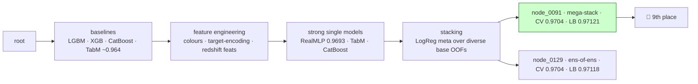

# 🌌 Kaggle Playground S6E6 — Stellar Classification · 🏅 9th place

Classify each sky object as **GALAXY**, **QSO** (quasar), or **STAR** from its
photometric + spectral measurements. Metric: **balanced accuracy** (higher is better).

> **Final result: 9th place.** The winning submission was **`node_0091`** — an L2-regularized
> logistic-regression **stack** over 63 diverse base models
> (public LB **0.97121**, cross-validation **0.970355**).

This repo is an **autonomous-but-supervised Kaggle agent** ("grandmaster"): a human pastes a
competition link and Claude Code drives the whole pipeline — data understanding, validation,
baselines, and a long propose → build → gate → decide experiment loop — pausing at human gates.
The full playbook is in [`CLAUDE.md`](CLAUDE.md); every experiment is recorded under
[`comps/playground-series-s6e6/`](comps/playground-series-s6e6/).

## The journey (144 experiments → the champion)



*(Simplified. The real graph has 143 nodes — see [`comps/playground-series-s6e6/graph.md`](comps/playground-series-s6e6/graph.md).)*

### The two locked finals picks
| pick | node | what it is | CV | public LB |
|------|------|-----------|-----|-----------|
| **★ won** | `node_0091` | L2-LogReg mega-stack (63 diverse bases) | 0.970355 | **0.97121** |
| hedge | `node_0129` | ensemble-of-ensembles meta over 6 stacks | 0.970410 | 0.97118 |

### What we learned
- **A well-built local CV beats the public LB.** The public LB is a noisy ~20% slice; we
  promoted on cross-validation, not LB chasing — which is what held up on the private split.
- **The data hit an information ceiling (~0.970).** With only `ugriz` photometry + redshift,
  single models cap around 0.970 and stacks around 0.9704 — confirmed ~10 ways. The remaining
  GALAXY-vs-STAR confusion sits at redshift ≈ 0 and needs a *different modality* (mid-IR /
  morphology) that the competition data doesn't provide.
- **Stacking only helps with *diverse* bases.** Averaging near-identical fold-models is a wash;
  the gains came from combining genuinely decorrelated model families.

## Layout

```
CLAUDE.md                     # the operating playbook (how the agent runs)
.claude/                      # skills, agents, workflows (the scaffolding)
tools/                        # reusable helpers (kaggle_io, make_folds, diagnostics…)
comps/playground-series-s6e6/
  graph.md                    # THE MAP: all 143 experiment nodes + the DAG
  journal.md                  # append-only narrative of every decision
  spec.md / eda.md / validation.md
  nodes/node_NNNN/            # one folder per experiment (plan + metrics + code)
  champion/                   # the winning node's code + reproduce commands
```

## Reproduce

Big files (data, `.npy`, model dumps, `folds.json`) are **not committed** — they're
regenerable, and the competition data may not be redistributed. To rebuild:

```bash
uv sync                                                    # install deps
cp .env.example .env                                       # add your KAGGLE_USERNAME / KAGGLE_KEY
uv run tools/kaggle_io.py download playground-series-s6e6  # re-fetch the data (accept comp rules first)
# then run the champion:
uv run python comps/playground-series-s6e6/champion/... # see champion/README for exact commands
```

---
Built with [Claude Code](https://claude.com/claude-code).
