# playground-series-s6e6 — experiments
metric: Balanced Accuracy Score (maximize) · champion: node_0091 (cv 0.970355 · lb 0.97121) · updated 2026-06-22T18:13Z (RealMLP-exploitation FLEET CLOSED — 0 promote, champion n091 stands: 0142 Optuna-HPO RealMLP +0.00005 only (HPO exhausted) · 0143 extreme 100-member diverse mega-bag (configs×seeds×bootstrap+RSM) solo 0.968795 PLATEAUED at ~member 20 BELOW seed n140 0.969305, err-corr 0.8815 (deeper into wall than n140's 0.87), stack-add to n091 P(B>A)=0.246<<0.90 → additive-zero. The extreme RealMLP play confirms the information ceiling from the bagging angle: diversification raises correlation, not decorrelation; RSM has no redundant features to drop in thin ugriz+z space. PRIOR-REGISTERED: 0142 Optuna-HPO RealMLP search → top-K configs (improve n028, exploit) · 0143 extreme diverse RealMLP mega-bag = configs×seeds×bootstrap+RSM, solo + stack-add to n091 (improve n142, exploit). Both reuse fs_realmlp_fe, GPU. PRIOR: ROUND 0135-0141 CLOSED — 0 promote, champion n091 stands; n135 TabPFN-FT DEFERRED for user-directed RealMLP fleet. Results: n136 wash(P0.42) · n137 ModernNCA 0.959 weak/corr0.69 · n138 curated-GBDT loses(P0.00, nonlinear-meta closed) · n139 ambiguity-gate holdout-flat · n140 redshift-RealMLP BEST-SOLO 0.969305 LB0.97009 · n141 LtR dead. WAS-REGISTERED — 7 proposed nodes (post-FM-family-close look-outside round): 0135 TabPFN-FT full OOF + stack-add (exploit, improve n133) · 0136 disagreement-feature augmented meta (data, combine n091/n070/n039/n033) · 0137 ModernNCA deep-retrieval base (outside, draft) · 0138 shallow GBDT meta on curated subset (exploit, combine n091/n039) · 0139 ambiguity-aux multi-task gates the stack / fs_ambig (wildcard, draft) · 0140 redshift-error-aware RealMLP / fs_zsoft (outside, draft) · 0141 learning-to-rank TabM dual-head (wildcard, draft). New feature-sets: fs_zsoft (stateless), fs_ambig (fit_in_fold). PRIOR: ROUND 0116-0120 CLOSED — 5 nodes, 0 promote, champion n091 stands. n116 LOO-prune 0.970369 (combine sub-axis closed) · n117 rank-vote 0.969272 (KEPT deferred finals slot-2 hedge) · n118 gen-fingerprint 0.966266 (corr 0.81) · n120 CatBoost ordered-TE 0.966366 (no family value; closes family-extend w/ n115) · n119 synth-pretrain TabM DEAD (copula pretrain hurts; augmentation lever closed). No untried internal lever remains → next round opens with a look-outside (fresh notebook + late-discussion scan). n116 LOO-prune 0.970369 (drop-deltas don't sum under L2 refit — pruning recovers nothing, combine sub-axis closed) · n117 rank-vote finals-hedge 0.969272 (0.76% disagreement vs n091, finals slot-2 candidate not a CV win) · n118 gen-fingerprint GBDT 0.966266 solo, leak-clean (worst fp↔class AUC 0.517) but err-corr 0.81 vs n070 + stack-add +0.000015 wash → decorrelation wall holds 6th time. — ROUND 0116-0120 REGISTERED — 5 proposals confirmed (full_auto): 0116 LOO-pruned restack drop 3 harmful bases (exploit) · 0117 max-decorrelated rank-vote finals hedge (outside) · 0118 generator decimal-fingerprint GBDT base / fs_genfp (data) · 0119 synthetic generative pretrain→finetune TabM / fs_synthpre (wildcard) · 0120 CatBoost ordered-TE + monotone-z recipe (data). ROUND 0102-0106 COMPLETE — all wash/killed, champion n091 stands: 0102 Saerens-EM MOOT (estimator-bias, OOF control) · 0103 flux-TabM cheap-killed BA0.940 BUT err-corr 0.485 = MOST DECORRELATED base ever → rich-flux-FE base is the next headline lever (research.md 2026-06-15) · 0104 Dirichlet-calib WASH (LogReg subsumes per-base scaling; base-input-transform axis closed) · 0105 revival re-stack NO STUDENT KEPT (distill/pseudo correlation-exclusion holds under shrinkage) · 0106 STAR-gate BA0.967 strong but corr0.796 → decorrelation=representation-not-framing. KEY: decorrelation only comes from new REPRESENTATION (flux 0.485 / RBF 0.53 / FT-T 0.53), never framing/meta-mechanism. FLUX FOLLOW-UP n0107/n0108: all 3 flux transforms (raw/rich/luptitude) hit IDENTICAL 0.940 BA ceiling at corr ~0.48 → flux/representation-decorrelation avenue STRUCTURALLY CLOSED. DEEP FINDING: tier strength REQUIRES the shared target-aware signal (TE cats + z-band) which is EXACTLY what makes all bases correlate ≥0.70 → strong-AND-decorrelated is structurally impossible here; bank is at its genuine INFORMATION ceiling, not a search artifact. ROUND 0109-0111 (off-axis, post-structural-finding): n109 flux-LightGBM BA 0.936 (GBDT ALSO caps → flux closed for ALL families, info-level); n110 redshift-aux-reconstruct decorr 0.54 / BA 0.886 (redshift irreplaceable); n111 STAR-weighted-TabM BA 0.968 / corr 0.83 (loss weights can't decorrelate). WALL now confirmed ~5 ways from BOTH sides: <0.65 err-corr ⇒ sub-tier; ≥0.965 BA ⇒ corr ≥0.72. Strong-AND-decorrelated is structurally impossible here. PRIOR: ★ PROMOTE node_0091 — full-pool L2 LogReg mega-stack @C0.003 PROBED to LB 0.97121 = BEST honest LB ever, beats prev-champ n063 0.97073 (+0.00048) AND n070 0.97087 (+0.00034); it is a strict SUPERSET of n063's bank under shrinkage so promotion is low-risk; sub-2sem CV margin overridden by decisive LB confirmation. n095 strict-z-resid-only KILLED (BA 0.72 — residuals-only destroys signal; decorrs 0.18 but useless); n096/n097 Nystroem-RBF DECORRELATED (err-corr 0.53-0.54, first since FT-T) but n098 stack-add HURTS (−0.00005, BA 0.947 too weak) → RBF lever CLOSED (decorrelation real but insufficient vs 2.4pp BA gap; n62 weak-but-decorrelated rule holds at corr 0.54). CLOUT slot-2 A4 vote 0.97123 now barely ahead of our HONEST n091 0.97121. STATE: combiner maxed + decorrelation axes all closed + public ecosystem exhausted — at the genuine honest ceiling) · (node_0047 specialist = CV mirage 0.970881 → LB crash 0.96242, permanently excluded) · DROP-STUDY 2026-06-16 (probes/drop_study_ranking.csv): LOO over the n091 FULL pool (63 bases, 5-fold @C0.003) — MAX single-base contribution = cat-3 +0.000158 (<1·sem 0.000274) ⇒ pool SATURATED/maximally-redundant, NO base individually significant; |coef| LIES (node_0039 biggest coef 0.977 but −6e-6 causal contribution — cat-3 covers it); CatBoost = the load-bearing family, RealMLP 2nd, TabM near-WORST (tabm-0 harmful). → node_0115 = TRUE-bag CatBoost (bootstrap+rsm decorrelation, the data-directed family; the old seed-bag n075 bagged TabM, the WRONG family)

```mermaid
graph LR
    root --> node_0000[node_0000 · majority baseline · 0.333]
    root --> node_0001[node_0001 · lgbm · 0.9646]
    root --> node_0003[node_0003 · catboost · 0.9613]
    root --> node_0004[node_0004 · xgboost · 0.9644]
    root --> node_0008[node_0008 · MLP/CUDA nn · 0.9550]
    root --> node_0009[node_0009 · TabM/CUDA nn · 0.9642]
    node_0004 --> node_0011[node_0011 · xgboost full feats · 0.9649]
    node_0003 --> node_0012[node_0012 · catboost full feats · 0.9620]
    node_0001 --> node_0002[node_0002 · threshold tune · 0.9646]
    node_0001 --> node_0005[node_0005 · lgbm heavy-reg · 0.9637]
    node_0001 --> node_0006[node_0006 · lgbm + research feats · 0.9650]
    node_0006 --> node_0013[node_0013 · +positional feats · 0.9640]
    node_0006 --> node_0007[node_0007 · combine blend · 0.9655 · lb 0.96702]
    node_0004 --> node_0007
    node_0001 --> node_0007
    node_0007 --> node_0010[node_0010 · combine + TabM · 0.9659]
    node_0009 --> node_0010
    root --> node_0014[node_0014 · FT-Transformer NN arm · 0.9573]
    node_0006 --> node_0015[node_0015 · lgbm dart variant · 0.9604]
    node_0009 --> node_0016[node_0016 · TabM balanced weights · 0.9644]
    node_0010 --> node_0017[node_0017 · blend threshold tune · 0.9661]
    root --> node_0018[node_0018 · lgbm + tgt-enc · 0.9648]
    node_0009 --> node_0019[node_0019 · bagged multi-seed TabM · 0.9645]
    node_0006 --> node_0020[node_0020 · stack + DE thresh · 0.9666]
    node_0004 --> node_0020
    node_0001 --> node_0020
    node_0009 --> node_0020
    node_0011 --> node_0020
    node_0003 --> node_0020
    node_0019 --> node_0020
    node_0016 --> node_0020
    node_0014 --> node_0020
    root --> node_0021[node_0021 · RealMLP base · 0.9501]
    root --> node_0022[node_0022 · TabPFN base · 0.9426]
    node_0003 --> node_0023[node_0023 · catboost undertrain fix · 0.9627]
    node_0021 --> node_0024[node_0024 · RealMLP-HPO · 0.9492]
    node_0022 --> node_0025[node_0025 · TabPFN-2.5 large-samples · 0.9490]
    root --> node_0026[node_0026 · TabICL · 0.9590]
    node_0025 --> node_0027[node_0027 · TabPFN-v3 multiclass · 0.9409]
    root --> node_0028[node_0028 · RealMLP ref recipe FE+PBLD · 0.9691]
    node_0020 --> node_0029[node_0029 · 10-base stack +RealMLP-ref · 0.9692 · lb0.96993]
    node_0029 --> node_0040[node_0040 · CORE 14-base stack · 0.9695]
    node_0040 --> node_0041[node_0041 · CORE+CatBoost 15-base · 0.9698 · lb0.97043]
    node_0034 --> node_0039[node_0039 · CatBoost richFE memfix · 0.9677]
    node_0039 --> node_0041
    node_0028 --> node_0029
    root --> node_0030[node_0030 · LightGBM richFE · 0.9670]
    root --> node_0031[node_0031 · XGBoost richFE · 0.9662]
    node_0028 --> node_0032[node_0032 · RealMLP seed-2 · 0.9691]
    root --> node_0033[node_0033 · TabM richFE · 0.9681]
    node_0003 --> node_0034[node_0034 · CatBoost richFE · OOM/buggy]
    node_0028 --> node_0035[node_0035 · RealMLP seed-3 · 0.9690]
    root --> node_0036[node_0036 · deep MLP richFE · 0.9657]
    root --> node_0037[node_0037 · LogReg richFE · 0.9393]
    root --> node_0038[node_0038 · ExtraTrees richFE · 0.9613]
    root --> node_0042[node_0042 · RealMLP config-B · 0.9691]
    root --> node_0043[node_0043 · CatBoost config-B · 0.9662]
    root --> node_0044[node_0044 · zoo xgb-v5 +orig-priors · 0.9677]
    node_0028 --> node_0045[node_0045 · RealMLP +orig-priors · 0.9690]
    node_0041 --> node_0046[node_0046 · pseudo-label self-train · 0.9697 wash]
    node_0041 --> node_0047[node_0047 · GALAXY-STAR specialist · cv0.9709 lb0.9624 MIRAGE]
    node_0031 --> node_0048[node_0048 · Optuna XGB stack-obj · 0.9698 wash]
    root --> node_0049[node_0049 · asymmetric binary chain · 0.9680 solo · stack neutral]
    root --> node_0050[node_0050 · OvR 3-binary · 0.9681 solo · stack neutral]
    root --> node_0051[node_0051 · FT-T on rich FE · 0.9669 · revival +0.0096 vs n14]
    node_0041 --> node_0052[node_0052 · re-stack discarded OOFs into CORE15]
    node_0042 --> node_0052
    node_0043 --> node_0052
    node_0049 --> node_0052
    node_0050 --> node_0052
    node_0011 --> node_0052
    node_0041 --> node_0053[node_0053 · multi-seed re-partition stack · 0.9698 neutral]
    node_0041 --> node_0054[node_0054 · 5-seed control · skipped/dead]
    root --> node_0055[node_0055 · DCN/CrossNet NN richFE · 0.9660 · stack neutral]
    root --> node_0056[node_0056 · 1D-CNN spectral NN · 0.9655 · stack flat, corr0.78]
    root --> node_0057[node_0057 · feature->image ResNet · KILLED fold-0 BA0.940 · warp adds noise]
    node_0057 --> node_0058[node_0058 · yolo26-cls+Muon aug ablation · KILLED fold-0 BA0.888]
    node_0028 --> node_0059[node_0059 · cleanlab prune RealMLP · 0.9691 · stack washes]
    node_0030 --> node_0060[node_0060 · LightGBM+SDSS17 provenance flags · 0.9666 · regress]
    node_0033 --> node_0061[node_0061 · GCE robust-loss TabM · 0.9668 · regress]
    root --> node_0062[node_0062 · swap-noise DAE rep + MLP · 0.9580 · <<floor]
    root --> node_0063[node_0063 · public 18-model bank stack · 0.9702 · lb0.97073 · prev champ]
    node_0063 --> node_0064[node_0064 · recover xgb-0/xgb-3 bank-19 · 0.9702 wash]
    node_0033 --> node_0065[node_0065 · confusion-zone mixup TabM · KILLED fold-0 0.9617]
    node_0028 --> node_0066[node_0066 · RealMLP pretrain SDSS17 · 0.9686]
    root --> node_0067[node_0067 · transductive distillation TabM · 0.9694]
    root --> node_0068[node_0068 · refresh public hard-vote · clout valid]
    node_0063 --> node_0069[node_0069 · champion + 5-seed bag · 0.9700 neutral; thresh dies post-bag]
    node_0063 --> node_0070[node_0070 · +FT-Transformer ext base · cv0.970211 lb0.97087 ★best-honest-LB]
    node_0055 --> node_0071[node_0071 · 5-seed bagged DCN · 0.9663 KILL@2seed wash]
    node_0063 --> node_0072[node_0072 · widen non-Deotte OOFs · 0.970211 ==n70, no new signal]
    root --> node_0073[node_0073 · AutoGluon best_quality · KILLED fold-0 0.9575]
    node_0033 --> node_0074[node_0074 · TabM A4-pseudo-test · 0.9685 solo+ CLOUT]
    node_0033 --> node_0075[node_0075 · 5-seed bagged TabM restack · 0.9682 KILL@2seed wash]
    node_0070 --> node_0076[node_0076 · FT-T base + bagged argmax stack · 0.970227]
    node_0069 --> node_0076
    root --> node_0077[node_0077 · new PRIMARY external OOF: 0 selected · 0.970211]
    node_0070 --> node_0078[node_0078 · post-bag STAR-recall calib washed · 0.970054]
    node_0033 --> node_0079[node_0079 · honest disjoint-teacher TabM · 0.967406]
    root --> node_0080[node_0080 · TabPFN-3 L1 meta-stacker · 0.969717]
    root --> node_0081[node_0081 · SAINT row-attention · KILLED fold-0 0.9647]
    root --> node_0082[node_0082 · NODE diff-trees · KILLED fold-0 0.9575]
    root --> node_0083[node_0083 · SDSS DR17 real-label · DEAD ~50%% match, coords≠labels]
    node_0076 --> node_0084[node_0084 · revive n67/n74 restack · 0.970240 no-promote]
    node_0067 --> node_0084
    node_0074 --> node_0084
    root --> node_0085[node_0085 · physics redshift-locus GBDT · 0.966742 wash]
    root --> node_0086[node_0086 · z-resid TabM · 0.9657 solo · err-corr0.72 stack-wash]
    root --> node_0087[node_0087 · z-resid LGBM · 0.9631 solo · err-corr0.70 stack-wash]
    node_0076 --> node_0088[node_0088 · n55 revival re-stack · 0.970227 no-select]
    node_0055 --> node_0088
    node_0076 --> node_0089[node_0089 · STAR BOOST sweep · b=1.0 best · knob closed]
    root --> node_0090[node_0090 · OvR chained RealMLP · 0.9677 solo · err-corr0.72 wash]
    node_0063 --> node_0091[node_0091 · L2-LogReg full-pool mega-stack C0.003 · 0.970355 · lb0.97121]:::champ
    node_0070 --> node_0091
    node_0063 --> node_0093[node_0093 · simplex convex blend · 0.9632 null]
    node_0070 --> node_0093
    root --> node_0094[node_0094 · error-pocket base err-corr0.79 · 0.9660 null]
    root --> node_0095[node_0095 · strict z-resid-only LGBM · KILL BA0.72 corr0.18 useless]
    root --> node_0096[node_0096 · Nystroem RBF base · KILL BA0.94 · corr0.530 DECORRELATES]
    node_0096 --> node_0097[node_0097 · stronger RBF 2000c richFE · KILL BA0.947 corr0.541]
    node_0097 --> node_0098[node_0098 · RBF full-OOF + stack-add · stack -0.00005 RBF CLOSED]
    node_0091 --> node_0099[node_0099 · LightGBM meta over full pool · 0.9688 −0.0016 overfit]
    node_0091 --> node_0100[node_0100 · FWLS region-interacted meta · 0.9698 −0.0005 wash]
    root --> node_0101[node_0101 · kNN-graph GraphSAGE base · BA 0.898 cheap-kill]
    node_0091 --> node_0102[node_0102 · Saerens EM test-prior · 0.9702 moot]
    root --> node_0103[node_0103 · TabM linear flux-space · BA 0.940 cheap-kill / corr 0.485]
    root --> node_0107[node_0107 · TabM RICH flux-space FE · BA 0.940 / corr 0.486 kill]
    root --> node_0108[node_0108 · TabM arcsinh-flux luptitude · BA 0.941 / corr 0.479 kill]
    root --> node_0109[node_0109 · LightGBM rich flux-space · BA 0.936 kill]
    root --> node_0110[node_0110 · TabM redshift-aux reconstruct · BA 0.886 / corr 0.54 kill]
    root --> node_0111[node_0111 · STAR-weighted TabM · BA 0.968 / corr 0.83 kill]
    node_0091 --> node_0112[node_0112 · broad revival re-stack 8 bases · no base kept]
    root --> node_0113[node_0113 · NCL-regularized TabM · INCONCLUSIVE γ too low]
    root --> node_0114[node_0114 · NCL frontier = CLIFF · wall confirmed]
    node_0091 --> node_0104[node_0104 · Dirichlet-calib bases · 0.9703 wash]
    node_0091 --> node_0105[node_0105 · revival re-stack · 0.9704 no student kept]
    node_0067 --> node_0105
    node_0079 --> node_0105
    root --> node_0106[node_0106 · STAR-gate specialist · BA 0.967 / corr 0.796 kill]
    root --> node_0115[node_0115 · true-bag CatBoost · BA0.967/corr0.79 kill]
    node_0091 --> node_0116[node_0116 · LOO-pruned restack drop 3 harmful bases · 0.970369]
    node_0091 --> node_0117[node_0117 · max-decorrelated rank-vote finals hedge · 0.969272]
    node_0039 --> node_0117
    node_0070 --> node_0117
    root --> node_0118[node_0118 · generator decimal-fingerprint GBDT base · 0.966266]
    root --> node_0119[node_0119 · synth gen-pretrain TabM · pretrain HURTS, kill]
    node_0039 --> node_0120[node_0120 · CatBoost ordered-TE + monotone-z recipe · 0.966366]
    root --> node_0121[node_0121 · SDR manifold kNN · BA0.897 sub-tier kill]
    node_0091 --> node_0122[node_0122 · region-interacted meta · 0.970286 wash]
    root --> node_0123[node_0123 · GALAXY focal-loss · BA0.960 kill]
    node_0030 --> node_0124[node_0124 · photo-metallicity+locus · 0.9667 entangled]
    node_0030 --> node_0126[node_0126 · physics ablation · 0.9665 lever CLOSED]
    root --> node_0125[node_0125 · spatial kNN class-frac · 0.9673 real-not-mirage entangled]
    node_0091 --> node_0127[node_0127 · MoE-gated 2-expert meta · 0.97042 holdout-fails]
    root --> node_0128[node_0128 · z-local color · 0.9667 entangled]
    node_0091 --> node_0129[node_0129 · ens-of-ens meta over 6 stacks · 0.970410]
    node_0070 --> node_0129
    node_0116 --> node_0129
    node_0063 --> node_0129
    node_0041 --> node_0129
    node_0040 --> node_0129
    node_0030 --> node_0130[node_0130 · template-chi2 SED-fit · 0.9667 entangled]
    node_0030 --> node_0131[node_0131 · per-class AE recon-gap · 0.9666 entangled]
    node_0030 --> node_0132[node_0132 · z-gated QSO bump-excess · 0.9667 entangled]
    root --> node_0133[node_0133 · TabPFN-v2 FINETUNE richFE · 0.9589 fold0 below-tier]
    root --> node_0134[node_0134 · Mitra FINETUNE richFE · 0.9542 fold0 below-tier]
    node_0133 --> node_0135[node_0135 · TabPFN-FT full OOF + stack-add · deferred]
    node_0091 --> node_0136[node_0136 · disagreement-meta · 0.9703 wash]
    node_0070 --> node_0136
    node_0039 --> node_0136
    node_0033 --> node_0136
    root --> node_0137[node_0137 · ModernNCA retrieval · 0.959 weak]
    node_0091 --> node_0138[node_0138 · curated-GBDT-meta · 0.9697 loses]
    node_0039 --> node_0138
    root --> node_0139[node_0139 · ambiguity-aux gate · 0.9693]
    root --> node_0140[node_0140 · redshift RealMLP · 0.9693 best-solo lb0.97009]
    root --> node_0141[node_0141 · LtR-TabM · dead]
    node_0028 --> node_0142[node_0142 · Optuna-HPO RealMLP · 0.9691]
    node_0142 --> node_0143[node_0143 · extreme diverse RealMLP mega-bag · 0.9688 null]
    classDef champ fill:#cfc,stroke:#070,stroke-width:2px,color:#062e06;
```

## nodes
| node | what it is | cv | lb | status | detail |
|------|------------|----|----|--------|--------|
| node_0000 | majority-class baseline | 0.333333 | 0.33333 | valid | `nodes/node_0000/node.md` |
| node_0001 | LightGBM, all feats + colors | 0.964569 | 0.96612 | valid | `nodes/node_0001/node.md` |
| node_0002 | per-class threshold tuning (post-hoc) | 0.964648 | — | valid (noise) | `nodes/node_0002/node.md` |
| node_0003 | CatBoost, native cats | 0.961294 | — | valid (undertrained) | `nodes/node_0003/node.md` |
| node_0004 | XGBoost, native cats | 0.964414 | — | valid (blend arm) | `nodes/node_0004/node.md` |
| node_0005 | LightGBM heavy-regularized | 0.963698 | — | valid (regressed) | `nodes/node_0005/node.md` |
| node_0006 | LightGBM + research features | 0.965004 | — | valid (best single) | `nodes/node_0006/node.md` |
| node_0007 | combine: blend n6+n4+n1 (0.40/0.40/0.20) | 0.965530 | 0.96702 | valid (prev champ) | `nodes/node_0007/node.md` |
| node_0008 | MLP on CUDA (nn, diversity arm) | 0.954969 | — | valid (blend no-help) | `nodes/node_0008/node.md` |
| node_0009 | TabM on CUDA (nn, `tabm` library) | 0.964215 | — | valid (key blend arm) | `nodes/node_0009/node.md` |
| node_0010 | combine: blend n6+n4+n1+**n9/TabM** | 0.965889 | 0.96704 | valid (prev champ) | `nodes/node_0010/node.md` |
| node_0011 | XGBoost, FULL 28 feats (GPU) | 0.964918 | — | valid (blend no-help) | `nodes/node_0011/node.md` |
| node_0012 | CatBoost, FULL 28 feats (GPU) | 0.961957 | — | valid (weakest) | `nodes/node_0012/node.md` |
| node_0013 | LightGBM + leak-safe positional feats | 0.963977 | — | valid (REGRESSED) | `nodes/node_0013/node.md` |
| node_0014 | FT-Transformer (rtdl), 2nd strong NN arm | 0.957317 | — | valid (0 blend weight) | `nodes/node_0014/node.md` |
| node_0015 | LightGBM DART boosting variant (trimmed 250t) | 0.960408 | — | valid (0 blend weight) | `nodes/node_0015/node.md` |
| node_0016 | TabM + balanced class-weighted loss | 0.964378 | — | valid (blend regresses) | `nodes/node_0016/node.md` |
| node_0017 | blend per-class threshold tune (fold-honest) | 0.966084 | 0.96702 | valid (BEST CV, <2sem) | `nodes/node_0017/node.md` |
| node_0018 | LightGBM + redshift-conditional target encoding | 0.964839 | — | valid (REGRESSED) | `nodes/node_0018/node.md` |
| node_0019 | bagged multi-seed (3) TabM arm | 0.964466 | — | valid (blend wash) | `nodes/node_0019/node.md` |
| node_0020 | 9-base balanced-logreg stack + DE threshold | 0.966627 | 0.96722 | valid (prev champ) | `nodes/node_0020/node.md` |
| node_0021 | RealMLP base (pytabkit) | 0.950098 | — | valid (weak; stack −0.0002) | `nodes/node_0021/node.md` |
| node_0022 | TabPFN-3 base (subsample ensemble) | 0.942629 | — | valid (weak; stack −0.0002) | `nodes/node_0022/node.md` |
| node_0023 | CatBoost undertraining fix (fs_colors) | 0.962737 | — | valid (+0.0014 vs n3; stack +0.00006 noise) | `nodes/node_0023/node.md` |
| node_0024 | RealMLP-HPO strengthened-TD (improve n21) | 0.949229 | — | valid (capped ~0.949; stack −0.00003) | `nodes/node_0024/node.md` |
| node_0025 | TabPFN-2.5 large-samples, proper ckpt+fast (improve n22) | 0.948957 | — | valid (stack −0.00007) | `nodes/node_0025/node.md` |
| node_0026 | TabICL (100k ctx, strongest NN base, 3.4min) | 0.958991 | — | valid (stack −0.00005) | `nodes/node_0026/node.md` |
| node_0027 | TabPFN-v3 multiclass (improve n25, ckpt swap) | 0.940930 | — | valid (weaker than v2.5) | `nodes/node_0027/node.md` |
| node_0028 | RealMLP reference recipe (FE+PBLD, n_ens=8) | 0.969065 | — | valid (BREAKTHROUGH base, +0.020 vs n24) | `nodes/node_0028/node.md` |
| node_0029 | 10-base stack (champ9 + RealMLP-ref) + DE thresh | 0.969205 | 0.96993 | valid (prev champ) | `nodes/node_0029/node.md` |
| node_0030 | LightGBM on rich fs_realmlp_fe | 0.966952 | — | valid (+0.002 vs n6; stack +0.00035) | `nodes/node_0030/node.md` |
| node_0031 | XGBoost on rich fs_realmlp_fe | 0.966244 | — | valid (+0.0013 vs n11; stack wash) | `nodes/node_0031/node.md` |
| node_0032 | RealMLP-ref seed-2 (bag) | 0.969119 | — | valid (bag partner of n28) | `nodes/node_0032/node.md` |
| node_0033 | TabM on rich fs_realmlp_fe | 0.968053 | — | valid (strong de-corr NN; stack +0.0002) | `nodes/node_0033/node.md` |
| node_0034 | CatBoost rich-FE (OOM fold4) | — | — | buggy (OOM; →debug n39) | `nodes/node_0034/node.md` |
| node_0035 | RealMLP-ref seed-3 (bag) | 0.968971 | — | valid (3-seed bag; +0.00003) | `nodes/node_0035/node.md` |
| node_0036 | deep MLP on rich FE (diversity) | 0.965682 | — | valid (HURTS stack −0.0002) | `nodes/node_0036/node.md` |
| node_0037 | multinomial LogReg on rich FE | 0.939309 | — | valid (HURTS stack −0.0001) | `nodes/node_0037/node.md` |
| node_0038 | ExtraTrees on rich FE | 0.961325 | — | valid (HURTS stack −0.0001) | `nodes/node_0038/node.md` |
| node_0040 | CORE 14-base stack (champ9+3RMLP+TabM+LGBM) | 0.969529 | — | valid (best-CV pre-cat) | `nodes/node_0040/node.md` |
| node_0039 | CatBoost rich-FE (memory-fixed) | 0.967723 | — | valid (lifts stack +0.00028) | `nodes/node_0039/node.md` |
| node_0041 | CORE+CatBoost 15-base stack | 0.969808 | 0.97043 | valid (prev champ) | `nodes/node_0041/node.md` |
| node_0042 | RealMLP config-B (wider/dropout) | 0.969110 | — | valid (config-div; stack −0.0001) | `nodes/node_0042/node.md` |
| node_0043 | CatBoost config-B (Lossguide d7) | 0.966209 | — | valid (stack wash −0.00003) | `nodes/node_0043/node.md` |
| node_0044 | zoo: xgb-v5 port (rich FE + in-fold TE + orig-priors + top-370) | 0.96769 | — | valid (stack −0.00012, washes) | `nodes/node_0044/node.md` |
| node_0045 | RealMLP-ref + orig-priors (upgrade n28 in-place) | 0.969050 | — | valid (solo flat, stack −0.00021..−0.00023) | `nodes/node_0045/node.md` |
| node_0046 | pseudo-label self-train (champion labels test, retrain GBDT bases) | 0.967125 | — | dead (stack −0.0001, washes) | `nodes/node_0046/node.md` |
| node_0047 | GALAXY-vs-STAR specialist at low-z, added as 16th stack base | 0.970881 | 0.96242 | dead (CV MIRAGE — LB −0.0080, reverted) | `nodes/node_0047/node.md` |
| node_0048 | Optuna XGB tuned to STACKED-OOF bal-acc objective | 0.969762 | — | dead (best trial +0.00005, washes) | `nodes/node_0048/node.md` |
| node_0049 | asymmetric binary chain (GALAXY-then-QSO/STAR), re-stack base | 0.968020 | — | valid (solo +0.0011 vs n30; stack neutral −0.00004) | `nodes/node_0049/node.md` |
| node_0050 | symmetric one-vs-rest 3-binary heads, re-stack base | 0.968134 | — | valid (solo +0.0012 vs n30; stack neutral −0.00003; ordering doesn't matter) | `nodes/node_0050/node.md` |
| node_0051 | FT-Transformer (rtdl) on fs_realmlp_fe (revive n14 on rich FE) | 0.966948 | — | valid (revival +0.0096 vs n14; <TabM; stack −0.00013) | `nodes/node_0051/node.md` |
| node_0052 | combine: re-stack discarded OOFs (n42/n43/n49/n50/n11) into CORE15 | 0.969808 | — | valid (null — all discards hurt; CORE15 stands) | `nodes/node_0052/node.md` |
| node_0053 | multi-seed re-partition meta stack (5 seeds × 10-fold, avg OOF+test) | 0.969845 | — | valid (+0.00004 NEUTRAL; holdout confirms; gap to public is base-set not stacker) | `nodes/node_0053/node.md` |
| node_0054 | 5-seed 5-fold control stack (seed-42 frozen-anchored; variance vs contamination diag) | — | — | dead (skipped — diagnostic moot once n53 showed no lift) | `nodes/node_0054/node.md` |
| node_0055 | DCN/CrossNet NN base on fs_realmlp_fe (no external data; re-stack candidate) | 0.966037 | 0.97083* | valid (CV-neutral but re-stack PROBE LB 0.97083 = +0.0004 vs champ, BEST LB; *re-stack lb. finals candidate) | `nodes/node_0055/node.md` |
| node_0056 | 1D-CNN spectral NN over wavelength-ordered bands [u,g,r,i,z] + scalar branch on fs_realmlp_fe | 0.965517 | — | valid (<TabM; stack −0.00011 flat; err-corr 0.78 — conv re-derives color slopes FE already has) | `nodes/node_0056/node.md` |
| node_0057 | feature->image ResNet: 7-ch rest-frame-warp SED-texture image (GAF/RP/MTF + zmod) + 2 side scalars, small from-scratch ResNet | 0.9401* | — | dead (KILLED fold-0: BA 0.940 <<TabM, *fold-0 only; warp-OFF 0.9415 > warp-ON → warp adds noise; feature->image family RETIRED) | `nodes/node_0057/node.md` |
| node_0058 | yolo26n-cls (pretrained, ImageNet-norm RGB) + MuSGD 2ep + aug ablation C0..C5 (TierA photometric / TierB regularizers / TierC geometric) | 0.8884* | — | dead (KILLED fold-0: best BA 0.888 <<TabM, *fold-0 best=C3 geometric; pretrained ImageNet backbone WORSE than n57 from-scratch 0.940; all aug tiers ±0.003 negligible; err-corr ~0 but BA too low; image-encoding ceiling ~0.888 confirmed → feature->image family DEFINITIVELY CLOSED) | `nodes/node_0058/node.md` |
| node_0059 | cleanlab confident-learning prune of flagged train rows → retrain RealMLP-ref (C1, data-centric) | 0.969115 | — | valid (noise CONFIRMED 2.3× concentrated in confusion zone, but +0.00005 solo & washes in stack — model already robust; NULL) | `nodes/node_0059/node.md` |
| node_0060 | LightGBM-richFE + SDSS17 coordinate-value provenance flags (C5, generator forensics) | 0.966623 | — | valid (generator REUSES real alpha/delta values 32-38%; flags carry class signal but overfit → solo −0.00033, stack washes; NULL) | `nodes/node_0060/node.md` |
| node_0061 | TabM-richFE with GCE(q=0.7) robust loss (C8, noise-robust objective) | 0.966788 | — | valid (−0.00127 regress; train/test share generator noise so CE is correct; robust-loss family dead; NULL) | `nodes/node_0061/node.md` |
| node_0062 | swap-noise DAE representation + balanced MLP head (C9, self-supervised; the one untried family) | 0.958002 | — | valid (<<0.964 floor; 26-dim tabular has no within-row manifold; DAE re-encodes known features at lower fidelity; no restack; family CLOSED) | `nodes/node_0062/node.md` |
| node_0063 | public 18-model OOF bank (Deotte) → balanced-LogReg stack on OUR folds (A1; 100% fold-match, no test-fit) | 0.970153 | 0.97073 | valid (prev champ) | `nodes/node_0063/node.md` |
| node_0064 | recover xgb-0 (strip orig rows)/xgb-3 (softmax margins) → bank-19 stack (exploit) | 0.970199 | — | valid (+0.000046 vs champ, <<2·sem WASH; xgb-0 dilutes, xgb-3 +0.000034; gap to Deotte LB not on CV) | `nodes/node_0064/node.md` |
| node_0065 | confusion-zone (low-z GALAXY/STAR) mixup augmentation on TabM-richFE (data) | — | — | buggy (KILLED fold-0 0.9617 < 0.9675; mixup tanks STAR recall, two-pass destabilizes) | `nodes/node_0065/node.md` |
| node_0066 | RealMLP-ref pretrain on real SDSS17 → fine-tune on fold (data; 3rd form of orig-data use) | 0.968560 | — | valid (below parent 0.969065; PBLD dims mismatch, only 9 hidden tensors transferred; pretrain neutral) | `nodes/node_0066/node.md` |
| node_0067 | transductive soft-label distillation of bank-17 → TabM student (wildcard) | 0.969414 | 0.96998 | valid (+0.00136 vs parent n33; LB 0.96998 <champ 0.97073; stack washes; no promote) | `nodes/node_0067/node.md` |
| node_0068 | refresh public-sub hard-vote (top-10, 70 unique families) — CLOUT/slot-2 ONLY | — | — | valid (clout; board barely moved since 06-10, 25 flips vs A4, 582 vs bank17; no honest CV) | `nodes/node_0068/node.md` |
| node_0069 | champion + 5-seed bag (seed-bag + DE-thresh, finals stability) | 0.970032 | — | valid (neutral; DE-thresh HURTS post-bag −0.00012, bagged-argmax 0.970156≈champ; sem wider; threshold edge is single-seed-fragile) | `nodes/node_0069/node.md` |
| node_0070 | bank-17 + FT-Transformer ext base (fwd-select) | 0.970211 | 0.97087 | valid ★ BEST HONEST LB — beats champ on BOTH CV (+0.000058) AND LB (+0.00014); FT-T is a real small lift (signals agree); finals slot-1 candidate | `nodes/node_0070/node.md` |
| node_0071 | 5-seed bagged DCN (n55, best-LB base) → restack | 0.966273 | — | valid (KILL@2seed; +0.000236 vs n55 but <1·sem; restack skipped; seed-bag wash confirmed for DCN too) | `nodes/node_0071/node.md` |
| node_0072 | widen bank: non-Deotte public OOFs (TabPFN-3/meta-stacker/gpu-lr) onto bank17+FT-T | 0.970211 | — | valid (the "high public OOFs" are themselves stacks of bank-17 → no new base signal; best +0.000014<eps; TabPFN-3 has no OOF; ==n70) | `nodes/node_0072/node.md` |
| node_0073 | AutoGluon best_quality base on rich FE (fold-0 gate first) | — | — | dead (KILLED fold-0: AG WeightedEnsemble 0.9575 << 0.9675; AutoML tops out below our tuned single models) | `nodes/node_0073/node.md` |
| node_0074 | TabM on A4 public-consensus pseudo-test — CLOUT/slot-2 ONLY | 0.968528 | — | valid (solo +0.000475 vs n33 — disjoint-teacher pseudo-label WORKS where n67 self-distill failed; restack=likely-wash; clout can't promote) | `nodes/node_0074/node.md` |
| node_0075 | 5-seed bagged TabM-richFE (n33) → restack | 0.968244 | — | valid (KILL@2seed wash; restack bank17+bag 0.970168, +n67 0.970237, <2·sem; TabM bag confirmed wash) | `nodes/node_0075/node.md` |
| node_0076 | combine: FT-T base + bagged argmax stack (no DE-thresh) | 0.970227 | — | valid (best honest cand) | `nodes/node_0076/node.md` |
| node_0077 | source new PRIMARY external OOF → fwd-select (0 selected) | 0.970211 | — | valid (clean-neg) | `nodes/node_0077/node.md` |
| node_0078 | honest post-bag per-class STAR-recall prior calibration | 0.970054 | — | valid (washed) | `nodes/node_0078/node.md` |
| node_0079 | honest disjoint-teacher pseudo-label TabM (external teacher) | 0.967406 | — | valid (below parent) | `nodes/node_0079/node.md` |
| node_0080 | TabPFN-3 as L1 meta-stacker over bank17+FT-T bases | 0.969717 | — | valid (below champ) | `nodes/node_0080/node.md` |
| node_0081 | SAINT row-attention (intersample) transformer base on fs_realmlp_fe | — | — | dead (fold-0 0.9647 < tier) | `nodes/node_0081/node.md` |
| node_0082 | NODE differentiable-oblivious-tree base on fs_realmlp_fe | — | — | dead (fold-0 0.9575 < tier) | `nodes/node_0082/node.md` |
| node_0083 | LightGBM-richFE + external SDSS DR17 coordinate-matched real labels | — | — | dead (coords ⊥ labels, ~50% match) | `nodes/node_0083/node.md` |
| node_0084 | combine: revive n67/n74 saved OOF as fwd-select adds onto n076 stack | 0.970240 | — | valid (honest +0.000014 no-promote; +n74 clout 0.970299 slot-2) | `nodes/node_0084/node.md` |
| node_0085 | physics redshift-locus features + monotone-z LightGBM base | 0.966742 | — | valid (wash, < parent n30) | `nodes/node_0085/node.md` |
| node_0086 | z-conditional color-residual TabM base (fs_zresid) | 0.965728 | — | valid (wash, err-corr 0.72 not decorrelated) | `nodes/node_0086/node.md` |
| node_0087 | z-conditional residual LightGBM base (fs_zresid) | 0.963099 | — | valid (wash, < parent, err-corr 0.70) | `nodes/node_0087/node.md` |
| node_0088 | combine: revival re-stack n55 DCN OOF onto n76 stack | 0.970227 | — | valid (n55 not selected, =n76) | `nodes/node_0088/node.md` |
| node_0089 | STAR-recall BOOST knob sweep on n76 meta | 0.970227 | — | valid (b=1.0 best, knob closed) | `nodes/node_0089/node.md` |
| node_0090 | OvR STAR-then-QSO/GALAXY chained RealMLP-ref base | 0.967670 | — | valid (wash, < parent, err-corr 0.72) | `nodes/node_0090/node.md` |
| node_0091 | combine: L2-LogReg mega-stack (nested C grid), FULL pool wins @C0.003 | 0.970355 | 0.97121 | **champion** (BEST honest CV+LB; strict superset of n063 under L2 shrinkage; promoted on decisive LB) | `nodes/node_0091/node.md` |
| node_0093 | combine: non-negative simplex convex prob-blend (FULL≈TIGHT) | 0.963155 | — | valid (null; per-base scalar can't match LogReg per-class coefs) | `nodes/node_0093/node.md` |
| node_0094 | draft: error-pocket-targeted LightGBM base (fs_errpocket_w, fit_in_fold) | 0.966021 | — | valid (null; err-corr 0.79 vs n070 — instance-weighting does NOT decorrelate) | `nodes/node_0094/node.md` |
| node_0095 | draft: strict z-residual-ONLY LightGBM base (fs_zresid_strict, fit_in_fold; drops raw z/mags/colors/mag-zscores) | — | — | valid (KILL fold-0: BA 0.72, residuals-only destroys signal; corr 0.18 but useless) | `nodes/node_0095/node.md` |
| node_0096 | draft: Nystroem RBF random-feature map → balanced LogReg head (fs_rbf_nystroem, fit_in_fold; new model class) | — | — | valid (KILL fold-0 BA 0.94 < 0.96 floor, BUT err-corr 0.530 — FIRST decorrelation since FT-T; lead for n097) | `nodes/node_0096/node.md` |
| node_0097 | improve n096: stronger Nystroem RBF (rich FE, 2000 comp) | — | — | valid (KILL fold-0 BA 0.947; err-corr 0.541 preserved; 4000c OOM, capacity-bound) | `nodes/node_0097/node.md` |
| node_0098 | improve n097: RBF full-OOF + champion stack-add test | 0.946874 | — | valid (RBF base HURTS stack −0.00005; err-corr 0.5625 confirmed but too weak; RBF lever CLOSED, n62 rule holds at corr 0.54) | `nodes/node_0098/node.md` |
| node_0099 | improve n091: LightGBM meta-stacker over full pool | 0.968784 | — | valid (null; GBDT meta overfits OOF −0.0016 vs LogReg; combine-mechanism axis CLOSED; n80 confirmed) | `nodes/node_0099/node.md` |
| node_0100 | improve n091: FWLS region-interacted meta-stack | 0.969815 | — | valid (FWLS washes −0.0005; region-adaptive base weighting recovers nothing, bases strong across all z-regions; region-adaptive-meta axis CLOSED) | `nodes/node_0100/node.md` |
| node_0101 | draft: kNN-graph GraphSAGE base (new graph family) | — | — | buggy (fold-0 BA 0.898 cheap-kill; PyG SAGEConv, too weak to reach tier; graph-family axis CLOSED) | `nodes/node_0101/node.md` |
| node_0102 | improve n091: Saerens EM test-prior correction | 0.970233 | — | valid (MOOT: apparent test-prior shift is EM-estimator bias, proven by identical bias on no-shift stratified OOF folds; OOF correction hurts −0.0001; prior-correction axis closed) | `nodes/node_0102/node.md` |
| node_0103 | draft: TabM on linear flux-space (fs_flux) | — | — | buggy (fold-0 BA 0.940 cheap-kill; BUT err-corr 0.485 = MOST decorrelated base ever — representation decorrelates, feature-starved at 21 feats/no cats → richer flux-FE is a live follow-up) | `nodes/node_0103/node.md` |
| node_0104 | improve n091: Dirichlet-calibrate bases before meta | 0.970309 | — | valid (WASH −0.00005; global LogReg already subsumes per-base scaling; base-input-transform axis closed) | `nodes/node_0104/node.md` |
| node_0105 | combine n091+n067+n079: revival re-stack under shrinkage | 0.970355 | — | valid (no student kept; distill/pseudo correlation-exclusion holds even under C0.003 shrinkage; revival axis closed) | `nodes/node_0105/node.md` |
| node_0106 | draft: STAR-gate hierarchical specialist base | 0.966614 | — | buggy (fold-0 BA 0.967 strong but err-corr 0.796 vs bank — hierarchical FRAMING does not decorrelate; cheap-kill. Decorrelation = representation not framing) | `nodes/node_0106/node.md` |
| node_0107 | draft: TabM on RICH flux-space FE (fs_flux_rich) | — | — | buggy (fold-0 BA 0.940 = EXACTLY n103; corr 0.486 robust. Rich FE/cats add nothing → flux ceiling is CONDITIONING not feature-count: raw heavy-tailed flux ratios are ill-conditioned for NN; the transform that conditions them (log) = colors. Next: arcsinh/luptitude middle transform) | `nodes/node_0107/node.md` |
| node_0108 | draft: TabM on arcsinh-flux luptitude FE (fs_luptitude) | — | — | buggy (fold-0 BA 0.941 / corr 0.479 — IDENTICAL ceiling to n103/n107 across all 3 flux transforms. Flux/representation-decorrelation avenue STRUCTURALLY CLOSED: flux geometry decorrelates (~0.48) but caps at 0.940 BA regardless of conditioning) | `nodes/node_0108/node.md` |
| node_0109 | draft: LightGBM on rich flux-space FE (fs_flux_rich) | — | — | buggy (fold-0 BA 0.936 < NNs' 0.940 even — GBDT ALSO caps on flux. DECISIVE: flux ceiling is INFORMATION-level not NN-conditioning; flux avenue closed for ALL model families) | `nodes/node_0109/node.md` |
| node_0110 | draft: TabM multi-task w/ redshift aux-reconstruct head | — | — | buggy (fold-0 BA 0.886 cratered / corr 0.54 — decorrelation achieved but redshift class-signal NOT reconstructable from photometry; 3rd confirmation of the decorrelation↔strength wall) | `nodes/node_0110/node.md` |
| node_0111 | draft: STAR-recall-weighted TabM base | — | — | buggy (fold-0 BA 0.968 strong but err-corr 0.80-0.83 — asymmetric loss weights on same arch+FE as n033 cannot decorrelate; STRONG-but-correlated failure mode, the wall's other side) | `nodes/node_0111/node.md` |
| node_0112 | combine n091+8 never-pooled bases: broad revival re-stack | 0.970355 | — | valid (NO base kept; all 8 never-pooled single bases wash under C0.003; combined w/ n105 distill students, EVERY never-pooled base tested — n091 pool is the complete useful set) | `nodes/node_0112/node.md` |
| node_0113 | draft: Negative-Correlation-Learning TabM base | — | — | buggy (INCONCLUSIVE: γ∈{0.1,0.3} too weak, err-corr unmoved 0.996≈baseline; penalty never engaged. Frontier untraced → re-run n114 aggressive γ) | `nodes/node_0113/node.md` |
| node_0114 | draft: NCL aggressive-γ frontier trace (γ 1/5/20) | — | — | valid (DEFINITIVE: NCL frontier is a CLIFF not a curve — γ1 BA0.968/corr0.99, γ5 BA0.027 COLLAPSED/corr−0.18. No decorrelated-AND-strong point exists; wall confirmed OPTIMALLY & discontinuously; base-search exhausted) | `nodes/node_0114/node.md` |
| node_0115 | draft: true-bag CatBoost (bootstrap+rsm, LOO-crowned top family) | — | — | buggy (fold-0 cheap-kill: BA 0.967 strong but err-corr 0.79/0.80 vs bank — ABOVE the 0.72 wall; bagging cuts variance not error-structure so it is MORE correlated, not less; "bag the top models" CLOSED) | `nodes/node_0115/node.md` |
| node_0116 | LOO-pruned restack drop 3 harmful bases | 0.970369 | 0.97110 | valid | `nodes/node_0116/node.md` |
| node_0117 | max-decorrelated rank-vote finals hedge | 0.969272 | 0.97003 | valid (finals hedge) | `nodes/node_0117/node.md` |
| node_0118 | generator decimal-fingerprint GBDT base | 0.966266 | — | valid | `nodes/node_0118/node.md` |
| node_0119 | synthetic generative pretrain then finetune TabM | — | — | dead (kill) | `nodes/node_0119/node.md` |
| node_0120 | CatBoost ordered-TE + monotone-z recipe | 0.966366 | — | valid | `nodes/node_0120/node.md` |
| node_0121 | SDR sharpened-manifold kNN base | — | — | dead (kill) | `nodes/node_0121/node.md` |
| node_0122 | region-interacted meta (redshift-band x base) | 0.970286 | — | valid | `nodes/node_0122/node.md` |
| node_0123 | GALAXY-recall focal-loss GBDT base | — | — | dead (kill) | `nodes/node_0123/node.md` |
| node_0124 | photo-metallicity + stellar-locus base | 0.966727 | — | valid | `nodes/node_0124/node.md` |
| node_0126 | physics ablation feh_phot + P2s only | 0.966535 | — | valid | `nodes/node_0126/node.md` |
| node_0125 | spatial kNN class-fraction base (falsification) | 0.967323 | — | valid | `nodes/node_0125/node.md` |
| node_0127 | MoE-gated 2-expert mixture meta | 0.970420 | — | valid | `nodes/node_0127/node.md` |
| node_0128 | z-local color-anomaly GBDT base | 0.966698 | — | valid | `nodes/node_0128/node.md` |
| node_0129 | ensemble-of-ensembles LogReg meta over 6 stacks | 0.970410 | 0.97118 | valid (finals contender) | `nodes/node_0129/node.md` |
| node_0130 | per-class template-chi2 SED-fit base | 0.966680 | — | valid | `nodes/node_0130/node.md` |
| node_0131 | per-class autoencoder recon-error-gap base | 0.966598 | — | valid | `nodes/node_0131/node.md` |
| node_0132 | z-gated QSO bump-excess base | 0.966675 | — | valid | `nodes/node_0132/node.md` |
| node_0133 | TabPFN-v2 FINETUNE on rich FE (1st finetuned FM) | 0.9589 (f0) | — | below-tier (best TabPFN here +0.010; <0.965 tier) | `nodes/node_0133/node.md` |
| node_0134 | Mitra FINETUNE on rich FE (tree-ensemble prior FM) | 0.9542 (f0) | — | dead (below-tier, 20k ctx; <n133 0.9589) | `nodes/node_0134/node.md` |
| node_0135 | improve n133: TabPFN-FT full 5-fold OOF + stack-add to n091 | — | — | deferred (GPU→RealMLP fleet) | `nodes/node_0135/node.md` |
| node_0136 | combine: disagreement-feature augmented L2 meta (uncertainty axis) | 0.970348 | — | valid (wash, P=0.42) | `nodes/node_0136/node.md` |
| node_0137 | draft: ModernNCA deep-retrieval base on fs_realmlp_fe | 0.959088 | — | valid (weak, corr0.69) | `nodes/node_0137/node.md` |
| node_0138 | combine: shallow GBDT meta over curated complementary subset | 0.969691 | — | valid (loses, P=0.00) | `nodes/node_0138/node.md` |
| node_0139 | draft: multi-task ambiguity-aux target gates the stack (fs_ambig) | 0.969328 | — | valid (holdout-flat) | `nodes/node_0139/node.md` |
| node_0140 | draft: redshift-error-aware RealMLP base (fs_zsoft) | 0.969305 | 0.97009 | valid (BEST SOLO, LB-probed) | `nodes/node_0140/node.md` |
| node_0141 | draft: learning-to-rank TabM dual-head (pairwise-margin + CE) | — | — | dead (corr0.85) | `nodes/node_0141/node.md` |
| node_0142 | improve n028: Optuna-HPO RealMLP search → top-K configs | 0.969113 | — | valid (HPO +0.00005 only) | `nodes/node_0142/node.md` |
| node_0143 | improve n142: extreme diverse RealMLP mega-bag (configs×seeds×bootstrap+RSM) | 0.968795 | — | valid (null — 100mem plateau<seed; corr0.88; stack-add P0.25) | `nodes/node_0143/node.md` |
